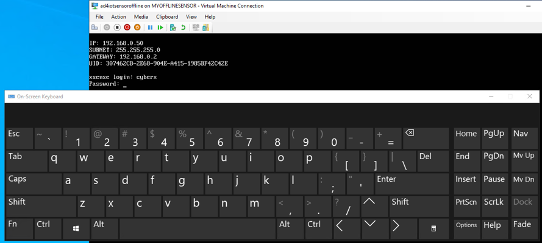

# Internet of Things - Microsoft Defender for IoT  HOL

Before starting this Lab make sure you completed the steps specified in the [prerequisites](../Before%20HOL/Microsoft%20Defender%20for%20IoT%20BHOL.md "Microsoft Defender for IoT Before Hands-on-Lab") file in this repository.

## Architecture Diagram ## 

During this workshop we will be focusing on setting up our Microsoft Defender for IoT sensors, for online alerts and also for offline scenarios.
You will learn how to configure your environment, assess the results, and integrate with SIEM systems like Microsoft Sentinel.
This Hands-on-Lab (HOL) will be focus on securing your facilities. 
It will cover brownfield and greenfield devices (currently not part of the HOL).
The scenario below is one of many you would apply these lessons to, other scenarios are Oil, Gas, Utility, and Energy companies.

</br>


</br>

## **Content:** ##
- [Exercise #1: Enabling Defender](#Exercise-1-Enabling-Defender)
    - [Task 1: Enabling Microsoft Defender for IoT](#Task-1-Enabling-Microsoft-Defender-for-IoT)
    - [Task 2: Create an IoT Hub:](#Task-2-Create-an-IoT-Hub)
    - [Task 3: Onboarding sensors](#Task-3-Onboarding-sensors)
- [Exercise #2: Setting up your offline sensor](#Exercise-2-Setting-up-your-offline-sensor)
    - [Task 1: Set up your offline sensor](#Task-1-Set-up-your-nested-Virtual-Machine)
    - [Task 2: Collect Information](#Task-2-Configure-a-Microsoft-Defender-for-IoT-offline-sensor)
- [Exercise 3: Enabling system settings](#exercise-3-enabling-system-settings)
    - [Task 1: System Properties](#task-1-System-properties)
    - [Task 2: Pcap Files](#task-2-Pcap-Files)
- [Exercise 4: Analyzing the Data](#Exercise-4-Analyzing-the-Data)
    - [Task 1: Devices Map](#Task-1-Devices-Map)
    - [Task 2: Alerts](#Task-2-Alerts)
    - [Task 3: Device Inventory](#Task-3-Device-Inventory)
    - [Task 4: Event Timeline](#Task-4-Event-Timeline)
    - [Task 5: Data Mining](#Task-5-Data-Mining)
- [Exercise 5: Online Sensor](#Exercise-5-Online-Sensor)
    - [Task 1: Reconfiguring sensor](#Task-1-reconfiguring-sensor)
- [Exercise 6: Integrate with Sentinel](#Exercise-6-Integrate-with-Sentinel)
    - [Task 1: Enabling IoT to Integrate with Sentinel](#Task-1-Enabling-IoT-to-Integrate-with-Sentinel)
    - [Task 2: Connecting Data Connectors](#Task-2-Connecting-Data-Connectors)
    - [Task 3: Acknowledge Alerts and Re-run PCAPs](#Task-3-Acknowledge-Alerts-and-Re-run-PCAPs)
    - [Task 4: Sentinel interaction with IoT Incidents](#Task-4-Sentinel-interaction-with-IoT-Incidents)
    - [Task 5: Kusto Query Language to Find Alert Details](#Task-5-Kusto-Query-Language-to-Find-Alert-Details)
- [Exercise 7: Clean Up](#Exercise-7-Clean-Up)
    - [Task 1: Delete resources](#Task-1-Delete-resources)
- [Appendix: Troubleshooting](Appendix-Troubleshooting)

</br>
</br>

## **Exercise #1: Enabling Defender**

### **Task 1: Enabling Microsoft Defender for IoT**

You will execute this task on your physical machine, not on the Virtual Machine that you will use later in this HOL to host your Microsoft Defender for IoT sensors.

</br>

1. In the [Azure Portal](https://portal.azure.com/#home "Microsoft Azure Home") open **Microsoft Defender for Cloud**. The first time you open Microsoft Defender for Cloud, you will need to click on **Upgrade**. This buttom will appear at the bottom of the screen, so make sure to scroll down.

    

</br>

2. Once enabled, on the left panel under **Cloud Security** select **Workload protections**

    

</br>

3. Next, select **IoT Security** under **Advanced Protection** section as shown below:

    

</br>

4. Next in the **Getting Started** section, select **pricing**.
 
    

</br>

5. On the **Pricing** page, select **Start with a trial**. 

    

    </br>

    In the popup screen leave all defaults (make sure you are using the same subscription you have been using for this lab) and click **Evaluate**, followed by **Confirm**.

    

</br>

You now have a valid Microsoft Defender for IoT Trial with 1000 committed devices. These devices represent all those equipments/sensors connected to your network in the facility you are analyzing. This configuration allows you for a 30 days trial for free.

</br>

### **Task 2: Create an IoT Hub:**

During this HOL you will work both with an online sensor and an offline sensor.
The offline sensor can operate completely disconnected, but the online sensor needs to be connected to an Azure IoT Hub. 
Before onboarding your sensors you will create an IoT Hub for your online sensor to connect to. 
You will execute this task on your physical machine, not in the Virtual Machine that we will use later in this HOL to host your Microsoft Defender for IoT sensors.

</br>

1. Go to the resource group you created for this training, in the Overview panel, you will see at the top **+ Create**, click there and type **IoT Hub** in the search box, then click **Create**.

2. In the next screen you will ask to fill the **Basics** tab:

    - **Subscription**: Select the Subscription you are woking on.
    - **Resource Group**: Should be the resource group created in previous step.
    - **IoT Hub Name**: hub-md4iot+SUFFIX
    - **Region**: A region close to your physical location (e.g. West Europe).

    </br>

    
 
</br>

3. Next, click on **Management** tab and make sure that **S1:Standard Tier** is selected in the **Pricing and scale tier** section.

4. Finally, click **Review + create**, once validation is completed, click **Create**.

5. While the IoT Hub is creating , in Azure Portal look for the Subscription, click on **Access Control(IAM)**, then select **+ Add**, a new window will open on your right, select the following:

    - **Role**: Contributor
    - **Assign access to**: User, group or service principal
    - **Select members**: search for the email you are using in this subscription. Select that email and click **Select**.
    
    </br>

    As a last step, click **Review + assign** and again **Review + assign**.

    Microsoft Sentinel will need this access to collect the alerts in further exercises when your sensor is online.

    

</br>

### **Task 3: Onboarding sensors** ###

For the hands-on lab we will work with two type of sensors, an offline sensor that does not need to be connected to the public Internet and an online sensor that is connectected to Azure.
In the next steps we will begin by onboarding the offline sensor.
You will execute most of this task on your physical machine, not in the Virtual Machine that we will use later in this HOL to host your Microsoft Defender for IoT sensors.

</br>

1. Go back to Microsoft Defender for IoT to create the sensors. You can find it by going to **Microsoft Defender for Cloud**, **Workload protections** then on the lower right side of the screen, under **Advanced Protection**, click on **IoT Security**.

2. You can download the latest sensor iso image here (from the **Sensor** section). You ***already did this step*** as a pre-requisite in the **Before HOL Section**. The iso file is already available in your VM so you don't have to download it to your VM right now. However, you need to know where to find the ISO file. In the **Getting Started** section, select **Sensor**, then pick the **10.5.5 (Stable) and above - Recommended** version. To download it, you would click **Download**. At this moment, download the iso file to your physical device.

    

    </br>

    > **NOTE:** At this moment, you might see a Window asking for contact details. You don't have to provide your contact details. Just go to the bottom of the windows and click on **Continue without submitting**. 

3. Next go to **Sites and Sensors** and click on **+ Onboard OT sensor**.

    

</br>

4. In the Setup OT/ICS Security screen, expand step 3 and set the following values: Sensor name = **myofflinesensor**, select your subscription and disable **Cloud Connected**. Click **Register**.

    

</br>

5. In the next step, you will be prompted to save the sensor activation file. Save it with the default filename and click **Finish**.

    

</br>

6. You should see your new sensor onboarded, locally managed, in your list of sensors as shown below.

    

</br>

7. Now, we will create another sensor. This will be an online sensor. Click on **+ Onboard OT sensor**, in the next screen input the following information:

    - **Sensor name**: myonlinesensor
    - **Subscription**: Select the subscription you are using for this lab.
    - **Cloud Connected**: Enabled (= default).
    - **Automatic Threat Intelligence Updates (Preview)**: Enabled (= default).
  
    **Site** Section
    - **Hub**: Select the IoT Hub you created in the previous step.
    - **Display Name**: MD4IoTHub, usually this name will represent the site you will be analyze such as Plant I.
    - **Zone**: Default.
    
    </br>
  
    

</br>
 
8. Click **Register**.

9. In the next step, save the activation file and click **Finish**.

10. Check again your **Sites and sensors** section. You should now see both sensors onboarded.

11. At this point you have 3 files downloaded locally (two zips licenses sensors and the iso file) we will upload them to the Storage account created in the section **Microsoft Defender for IoT BHOL**. In this way we will be able to make those files available to download in the Virtual Machine. Another option could be to download the files directly in the Virtual Machine, if you are logged in into the Azure Portal inside the VM. However, sometimes you will have policies on place not allowing this, so the storage account route will make this feasible.

    The next steps will be executed in the Virtual Machine that we created as part of the pre-requisites.

12. To Upload the Files, go to the Storage Account you created before in the Azure Portal. On the left panel select **Containers**, on the right side, click on **acitvationfiles**, next on the top menu click **Upload** browse to the location where you download the files, select all of them and click **Upload**.

    You will execute this task on your Virtual Machine. Make sure to start it from the Azure portal and connect to it using RDP. You should use the same credentials to login to your VM that you used when you created the VM (**Username**: *MDefenderLab*, **Password**: *Learningmode123!*). 

13. In your Virtual Machine, open **Storage Explorer**. You will be ask to login to your Azure account where you just upload the files. Then select 
**Subscription**.

    

</br>

14. Next, click on **Azure**, **Next**. Now **Sign in** to Azure. Once you are signed in, close the browser, in the Storage explorer you you should see your subscription. You might need to select multiple directories, in the Account section to see your subscription. then **Open Explorer** to see your storage accounts.

15. On the left panel, select **Storage Accounts** under your Subscription.

16. Once you selected the container on the right side you should see the files, just select the files and click **Download**

    

</br>

## **Exercise #2: Setting up your offline sensor**

During this exercise you will set up a new nested Virtual Machine inside the Virtual Machine that you created as part of the pre-requisites.

### **Task 1: Set up your nested Virtual Machine**

1. On the Windows 10 Virtual machine created previously, login with with RDP. Open a command prompt and run the command "ipconfig". **NOTE: Ignore the (Default Switch)**

    

</br>

2. Take note of the IP address used on your Windows 10 Host's Ethernet Adapter. **NOTE: Ignore the (Default Switch)**

    > **NOTE:** In this example, the Win10 host Ethernet Adapter is assigned an IP of 10.0.0.4, therefore we will use 192.168.0.0/24 as the network scope of the “NATSwitch”.  If your primary adapter is already using 192.168.x.x, then use 172.27.0.0/24 for your “NATSwitch”.

3. Open a PowerShell prompt as an Administrator by searching for PowerShell and right-clicking to "Run as administrator".

4. Run the next two commands in the PowerShell window.

    ```powershell
    New-VMSwitch -SwitchName "NATSwitch" -SwitchType Internal
    ```

    ```powershell
    New-VMSwitch -SwitchName "MySwitch" -SwitchType Internal
    ```

5. Run the following command to store the network adapter information to a local variable.

    ```powershell
    $s1 = Get-NetAdapter -name "vEthernet (NATSwitch)"
    ```

6.  Assign an IP address to the NATSwitch (either 192.168.0.1 or 172.27.0.1) depending on your network address based on step 1.

    ```powershell
    New-NetIPAddress -IPAddress 192.168.0.1 -PrefixLength 24 -InterfaceIndex $s1.ifIndex
    ```

7. Create the new NAT network.  Again, your IP address space will either be 192.168.0.0/24 or 172.27.0.0/24 depending on step 1.

    ```powershell
    New-NetNat -Name MyNATnetwork -InternalIPInterfaceAddressPrefix 192.168.0.0/24
    ```

    

</br>

8. Inside the VM, in the windows search box, type **Hyper-V** and enter. This should open a new window with the Hyper-V console. Select **New** on the left side. This will show multiple options, select **Virtual Machine**.

    

    </br>

    - First tab, assign a name **md4iotsensoroffline**, then click **Next**

    - **Specify Generation**, select **Generation 1**, click **Next** again.

    - Change the memory to **8196MB**, **Next**.

    - **Configure Network** tab, select in **Connection**, **NATSwitch**, **Next**.

    - **Connect Virtual Hard Disk** tab, **Create a virtual hard disk** click **Next**.

    - **Installation Options**, select **Install an operating system from a bootable CD/DVD-ROM** then select **Image file (.iso)** and browse to the Azure defender .iso file that you downloaded in the pre-requisites. Last **Finish**

    

</br>

9. Right click on the Virtual machine that you just created, select **Settings** in the **Add Hardware** section and select **Network Adapter**, followed by clicking on **Add**. Now select the virtual switch created previously with the name **My Switch**, and click **Apply**.  Increase the Processor number from **1** to **4** Virtual Processors, click **Apply** and click **Ok**.

### **Task 2: Configure a Microsoft Defender for IoT offline sensor**

During this task we will configure Azure Defender based on the IPs highlighted before, this first configuration will be based on an offline sensor.

1. In the Hyper-V Manager, right click on the VM and select **Start**, then in the console click **Connect**.

2. When you connect to the Ubuntu VM you should see the following screen to start the configuration process. 

    > **Note!**: If you don't see the screen below, your installation timed out or you pressed enter, selecting a different configuration by mistake, delete the virtual machine and start this task over. The timeout period is relatively short so make sure you connect immediately to the nested VM and select the language and the sensor type (in Task 2).

    </br>

    

</br>

3. Press **Enter** for English.

4. Select the third option *(Office 4CPUs)* and press **Enter**.


    

</br>

5. You will be ask to fulfill some parameters, it is ***VERY IMPORTANT*** you pay attention to the previous task because you will use the network information you captured before, this is unique to each Virtual Machine. So the following is an **EXAMPLE**.

- **configure hardware profile**: **office**, then press enter. 
- **Configure network interface**, type **eth0**
- **Configure management network interface**: in this example we're using **192.168.0.50**, you will use one of the **Ipv4 Addresses** depending on your network scope from the previous task, either **192.168.0.50 or 172.27.0.50**. Click Enter to continue. ***Take a note of this IP you will need it later on***.
- **Subnets mask**: **255.255.255.0** this will be the SAME for everyone.
- **Configure DNS**: **8.8.8.8**
- **Configure default gateway IP Address**: We are intentionaly mis-configuring this value to force the sensor in **offline** mode. Use either 192.168.0.**2** or 172.27.0.**2**.
- **Configure input interface(s)**: **eth1**
- **Configure bridge interface**: Just press Enter
- Then type **Y** to apply the changes and click **Enter**.

    Now the installation will run for 10-15 minutes.

    ***Troubleshooting Note: Once the installation is complete, you will be able to access Azure Defender Console, check if you can open a cmd window, ping the IP Address  you entered in the step 'Configure management network interface'.
    If the request times out, you will need to reconfigure this step again, for that review the IPs one more time and use the command below to start over:***

    ```bash
    sudo cyberx-xsense-network-reconfigure
    ```

    Below, a ***sample*** screen, your parameters will be different.

    

    </br>

6. ***IMPORTANT STEP!!!*** Once the installation is complete, you will have the login information availabe in the screen **TAKE A SCREENSHOT!!** before continuing, press **Enter**. Now you will have the support account, again **TAKE THE SCREENSHOT!!** press **Enter** to continue. If you fail to capture the credentials, you will need to start over.

    </br>

    

    </br>

7. Once the installation finished you will ask to login, enter the credentials from previous step. In this screen you can also validate the IP, you will use that IP in your browser.

    </br>

    ***Note:** At this stage your IPs should look similar to the example below, if you can't reach the portal validate the IPs. If you restarted your VM there is a chance your IPs changed so you will need to go back and reconfigure them, if that is the case use the command in step 3.***

    In the next steps you will be prompt to enter the password capture above, some characteres look alike but they are not, this image will help you to identify some of them.

    

</br>

8. Login with the credentials provided in step **4**.

    

    </br>

    > **NOTE:** the "md4iotsensoroffline" VM's keyboard layout is US by default, and it may not match the layout of your physical keyboard. To avoid issues when entering the password, you may use the windows 10 on-screen keyboard. To run it, type "osk" in the search box and click on "On-Screen Keyboard"

    </br>

    

    </br>

    ...and use it to enter the credentials:

    

</br>

9. Next, you will be ask to activate the product, click **Upload**, then **Browse Files**, in your downloads folder select the file you downloaded from the Storage Explorer, in this example **myofflinesensor.zip**.

    

</br>

10. Click **Approve these terms and Conditions**, then **Activate**.

11. You will be prompted to select **SSL/TLS Certificates | Onboarding 1/2** for this lab will use the second option **Use a locally generated self signed certificate(..)**. Then click **I CONFIRM**, **Next**.

    

</br>
 
12. For this lab in the next step we will **Disable** the system wide validation. **Finish**.

13. Let's analyze together what information we already have available before moving forward.

</br>

## **Exercise 3: Enabling system settings**

### **Task 1: System Properties**

1. In your offline sensor you will find **System Settings** on the left side of the Azure Defender portal, click there as shown below.

    

</br>

2. Next, look for the icon **System Properties** on the right side. Click on the icon. You you will see a pop up warning, select **Ok**.

3. In the new window on the left side, scroll down until you see **Pcaps**, click there. Now on the right side scroll all the way down and we will modify three parameters as shown below:

    - **player_max_amount=200**
    - **enabled=1**
    - **player.params=-M 3**

    </br>

    

</br>

4. Click **Save** and then **Ok**.

5. Continue in the System Properties window, scroll up and select **Horizon** on the left side select, scroll down and modify the following parameter:

    - **ui.enabled=true**

    </br>

    

</br>

6. Click **Save** and then **Ok**.

7. In System Properties, look for **Global** and modify the following parameter:

    - **auto_discovery.enabled=1**

    <br>

    

</br>

8. Click on **Save** and then **OK**.

9. At this point you should see the Pcap Player available (you can close the **Edit System Properties** screen now by clicking the **Cancel** button):

    

</br>
  
### **Task 2: Pcap Files**

1. In a previous step you already downloaded a  **holpcaps.zip** file from the Storage account. It should be in your Azure Virtual Machine's **Downloads** folder.

2. Unzip **holpcaps.zip**

3.  Go back to Azure Defender, Click on **System Settings**, then **PCAP Player** now select **Upload**,
**Browse Files**, browse to the folder where you download the files in the previous step, select all the files and click **Open**. This operation will take a few minutes to upload all the files.

4. At this point you should see all the files uploaded.

    

</br>

5. Click on **Play All**, in a few minutes you will receive a message saying all the files has been played. 

</br>

## **Exercise 4: Analyzing the Data**

After Azude Defender learnt about your environment it will be able to share insights pretty fast.

### **Task 1: Devices Map**

Your first interaction with Devices map you will see a similar map like the one below (details of what you actually see may vary):


</br>

1. Use the four icon bar on the left to select **Layout by Purdue**. In this model you will see the different layers between Corporate IT and site operations.

    

</br>

2. Check your notifications available and you can take action at this point.

    

</br>

3. For each device right click to analyze properties, show events, reports and simulate attack vectors.

    

</br>

4. In the hamburger menu on the left, click the highlights and select one of the **OT Protocols** i.e. **MODBUS** and click on **Filter**. Now your map will show those devices only

    

</br>

5. Then filter your devices by **CIP** OT Protocol, at the bottom of your map you will see a PLC, where the Vendor is Rockwell Automation, has already 3 alerts activated. Right click on the device, **View Properties**. In this view you will be able to analyze the Backbone of your PLCs, take actions and analyze the Alerts.

    

</br>

### **Task 2: Alerts**

1. Once you click Alerts in your PLC you will see a new window pop up showing three different types of alerts.

    - Operational(high Alert and lower alert)
    - Policy Violation

    For each of these alerts you will be able to analyze the pcap file, export a report, analyze the timeline or mute the alert.

    
    
    </br>

2. If we remove the device filter from the top of the screen, then click **Confirm** you will see 20 Alerts in process.

3. Apply **Custom Groups** to filter different scenarios, such as **Unclassified subnets** then **Confirm**

    

    </br>

### **Task 3: Device Inventory**

1. In this view, filter all your devices by **Is Authorized**, True or False are possible values.

    > **NOTE:** if you don't see the column "Is Authorized", click on the "Device Inventory Settings" gear icon (upper-right corner) and add it to the view.

    

    </br>

2. Organize your devices based on filters.

3. Export the list to a csv files.

<br>

### **Task 4: Event Timeline**

This view will allow you a Forensic analysis of your alerts.

1. Choose **Advanced Filters**, filter the timeline by **CIP**, let's analyze the alert timeline.

    

</br>

### **Task 5: Data Mining**

In this section you can create multiple custom reports.
As an example we will create a Report based on firmware updates versions.

1. Go To **+**, **New report**, in the categories section select **Modules and Firmware update versions**

2. Assign a name to your report. Then go to Filters, **add** and select **Firmware version(generic)**

    

</br>

3. In the new field added **Firmware Version(GENERIC)** add **0.4.1**, then **Save**.

4. You can remove the filter to list all the firmware updates version in your list also.

5. Export you report(pdf, csv) for further actions. 

</br>

### **Task 6: Risk Assessment**

1. Go to the Risk assessment, run the assessment. During this task we will show you how to analyze the assessment. 

> **IMPORTANT:**, after completing this workshop you will have a period of two weeks to run the risk assessment in your evironment and schedule an appointment with our Cybersecurity team to guide you through analysis, best practices, and vulnerabilities in your facilities.

</br>

## **Exercise 5: Online Sensor**

To modify our sensor to be an online sensor, we will use the same virtual machine, but we will reactivate the sensor using **System settings**. In a real scenario you probably would create a new sensor, running in its own virtual machine or physical appliance.

### **Task 1: Reconfiguring sensor**

To modify your sensor to be connected with Azure, we will need to modify the network configuration.

1. Login into the "md4iotsensoroffline" VM using the "cyberx" credentials (task 2, step 4).

    > **NOTE:** the "md4iotsensoroffline" VM's keyboard layout is US by default, and it may not match the layout of your physical keyboard. To avoid issues when entering the password, you may use the windows 10 on-screen keyboard. To run it, type "osk" in the search box and click on "On-Screen Keyboard":

    </br>

    

    </br>

    ...and use it to enter the credentials:

    

</br>

2. You will receive a **network unreacheable** error message if you try to ping the google dns:

    ```bash
    ping 8.8.8.8
    ```

    Your sensor needs connectivity before changing the activation mode.

3. In the Ubuntu sensor we will need to reconfigure the gateway to bring it online and allow it to reach Azure IoT Hub, type the following:

```bash
sudo cyberx-xsense-network-reconfigure
```

4. You will ask to login, then you can start to reconfigure the network settings, you will only change **one** value, **configure default gateway IP address** you will assign the IP Address of the NATSwitch value configured in previous steps, either 192.168.0.**1** or 172.27.0.**1**, you will keep all the other values as before.

    

</br>

5. Type **Y** at the end of the process to apply the change, it will run a reconfiguration and reboot. 

6. After logging back in, test that you have external connectivity: **ping 8.8.8.8** in the Ubuntu sensor, you should now receive a different message  containing "...icmp...".  Note: hit Cntrl-C to stop the pinging.

7. Now that your sensor has connectivity, go to the Azure Defender Portal, select **System Settings** and then, **Reactivation**.

8. In the new window, select **Upload**, **Browse File**, select the zip file you downloaded from the storage account in previous steps **myonlinesensor.zip**, then **Open** and **Activate**, **Ok** to the instructions

    

</br>

8. Last, you should receive a message showing your sensor modified to **Connected**. 

9. Close the screen, open again the **Reactivation** window and double check if your sensor is **Cloud Connected** as shown below:

    

</br>

10. Run the Pcap files again in your console, in a few minutes you can verify if IoT Hub in Azure Portal is receiving messages from your sensor:

    

</br>

11. In the same IoT Hub now you should see the alerts generated by Defender for IoT. Scroll down to **Defender for IoT**, select **Security Alerts**, on the right side you will see some alerts already available.

    

</br>

## **Exercise 6: Integrate with Sentinel**

You will execute most of this task on your physical machine, not in the Virtual Machine that hosts your your Microsoft Defender for IoT sensor.

**Note**: Please ensure you have completed Task 6 in the ['Before HOL'](https://github.com/mpram/Azure-Defender-for-IoT/blob/main/Before%20HOL/Azure%20Defender%20for%20IoT%20BHOL.md#task-6-sentinel-prep-work/ 'Before HOL') prior to working through these instructions.

### **Task 1**: Enabling IoT to Integrate with Sentinel

1. Ensure your IoT Hub is configured to send Security Alerts to Sentinel.
2. Navigate to your IoT Hub > Defender for IoT > Settings > Data Collection

    

</br>

3. Double check that Data Collection blade, is enabled for  **Enable Microsoft Defender for IoT**
 
    

</br>

### **Task 2**: Connecting Data Connectors
	
1. With the *Microsoft Defender for IoT* switch enabled, go to **Microsoft Sentinel** > Configuration > Data Connectors > Search **Microsoft Defender for IoT** to connect Microsoft Defender for IoT to Microsoft Sentinel.
 
    

</br>

2. Click the **Open Connector Page**
 
    

</br>

3. Review the instructions and click the “Connect” button to connect Azure Defender for IoT to Sentinel. If the connection continues to fail, this will most likely be due to the user not having the "Contributor" permissions and you may have missed the access step in the prerequisites. 

    

</br>
 
4. If connected correctly you should expect to see the Status change to “Connected” and the link light up green.
 
    

</br>

5. Use the next steps tab to enable Out of the Box alerts. For example, click the create rule and follow the instructions to turn on the rule.
 
    

</br>

6. Fill in the “Name” and click **Review and Create**, followed by **Create**. This is enabling incidents to be created based on the Azure Defender IoT alerts that are ingested into Sentinel.
 
    

</br>

7. Additionally, you can create the rule not only on the data connectors page but also on the Microsoft Sentinel “Analytics” blade. See an example below when you go to the “Rule Templates” tab and filter data sources by “Microsoft Defender for IoT (Preview)”.

    

</br>
 
### **Task 3**: Acknowledge Alerts and Re-run PCAPs

You will execute most of this task on the Virtual Machine that hosts your your Microsoft Defender for IoT sensor.

1. Go back to your browser interface and acknowledge all of the alerts. The reason we are doing this is so we can re-run the alerts to show how they are sent and analyzed by Sentinel.

	1. Navigate to the Alerts Page
	2. Click the double check box
	3. Click **Ok** to acknowledge the alerts 
    
    </br>

    

    </br>

    4. Now go to the System Setting tab.
    5. Click the **Play All** on the PCAP Files to replay simulating the alerts.

    

</br>

### **Task 4**: Sentinel interaction with IoT Incidents

You will execute most of this task on your physical machine, not in the Virtual Machine that hosts your your Microsoft Defender for IoT sensor.

1. Go back to the Sentinel console and under the **Threat Management** section, select the **Incidents** tab.  Filter by Product Name **Azure Defender for IoT**.

    

</br>
  
2. Select one of the alerts and click **View full details**

    

</br>
 
3. It will take you to this screen to get all the information relative to the incident. This allows analyst to get more details on the entity including what other alerts made up the incident, playbooks to enrich the context of the alert, and comments section to leave details on what the analyst discovered during review or how they came to the determination to dismiss the incident.

    

</br>

4. By clicking the **Investigate** button, you can dig deeper in the cause of the incident and the relation to other incidents.

    

</br>
 
### **Task 5**: Kusto Query Language to Find Alert Details

1. Navigate to the “Logs” tab and run this query. Querying the data will provide the ability to join tables and datasets to curate data from multiple sources. KQL is a similar language to SQL but will take some research and some dedicated time to become familiar with.

Here are two basic examples:

```sql
	SecurityAlert | where ProviderName contains "IoTSecurity"
```
 


</br>

```sql
	SecurityAlert | where CompromisedEntity == "hub-md4iot-mst01"
```
 


</br>

## **Exercise 7: Clean Up**

### **Task 1: Delete resources**

The Azure Passes will allow you to run the services for 90 days for training purposes. Although it is a best practice to delete all your resources after the training. 

Search for the Resource Group created for this training.

Select Delete resource group on the top right side.

Enter your-resource-group-name for **TYPE THE RESOURCE GROUP NAME** and select Delete. This operation will take a few minutes.

After that is done go to Azure defender for IoT and deactivate the subscription.


## **Appendix: Troubleshooting**

1. If your Defender portal is not working properly run the following command to validate if the components are running properly

```powershell
cyberx-xsense-sanity
```


2. If your IoT hub is not receiving messages, check if ubuntu machine can reach IoT Hub, first run the following command to identify the IP of your IoT Hub:


```powershell
netstat -na | grep EST | grep -v 127.0.0.1
```


Then, ping the IoT Hub using the connection string from the overview blade in Azure Portal.


